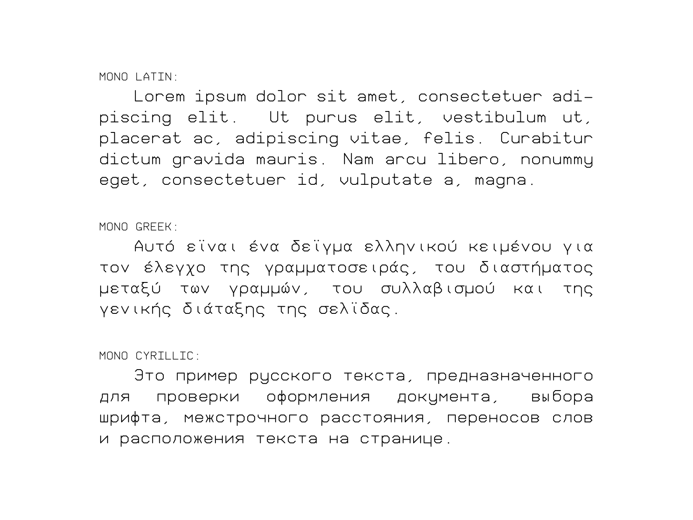
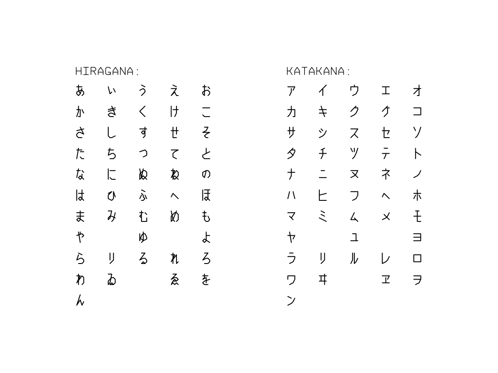
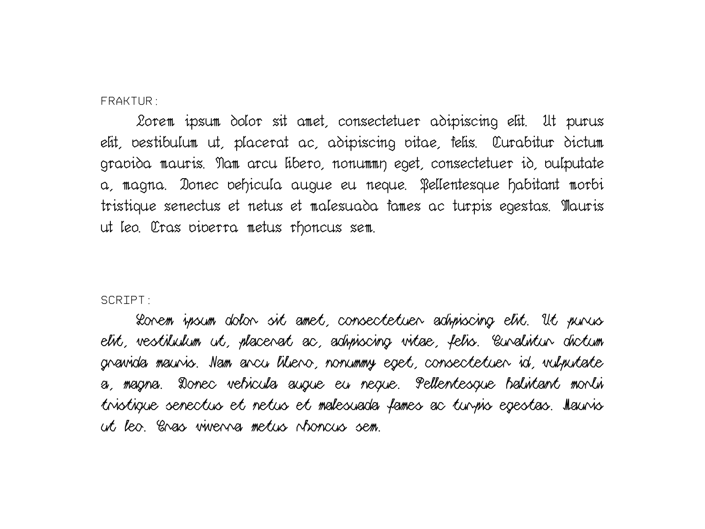
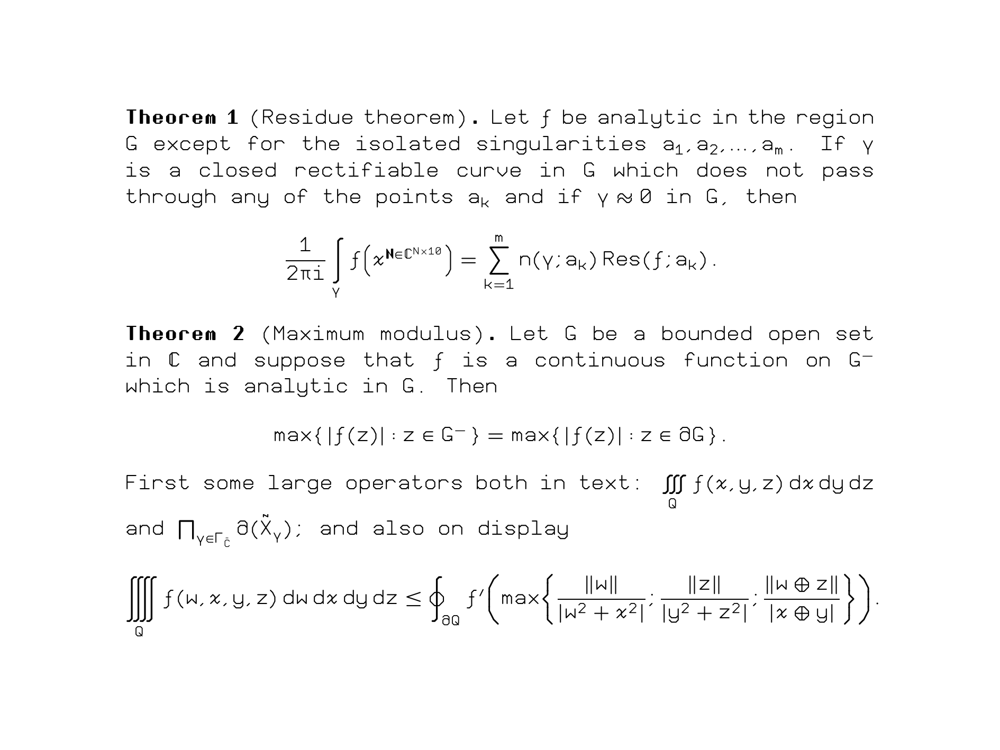

<p align="center">
  
</p>

[English](README.md) | 中文

PL46 是一族以端点坐标为整数的线段作为基本造型元素的 OpenType 字体。 它涵盖了拉丁字母、希腊字母、西里尔字母与日文假名，其中拉丁字母的部分有哥特体和手写体两种字形可供选择。 对于那些喜欢摆弄式子的大科学嘉，本字体还提供了 OpenType MATH 支持。这意味着你可以在 XeLaTeX / LuaLaTeX 等软件中使用它。(¦3【▓▓】

本字体在持续施工中——字形、字距与度量数据仍有可能被调整或修改。

## 字体示例
<p align="center">
  
  
  <br>
  
  
</p>

## 字体族
目前 PL46 提供以下字体文件：

| 文件名 | 支持 | 字符总数 |
| --- | --- | --- |
| `PL46-Mono.otf` | 拉丁字母、希腊字母、西里尔字母 | 550 |
| `PL46-JP.otf` | 拉丁字母、日文假名 | 297 |
| `PL46-Bold.otf` | 拉丁字母 | 97 |
| `PL46-Fraktur.otf` | 拉丁字母 | 97 |
| `PL46-Script.otf` | 拉丁字母 | 97 |
| `PL46-Math.otf` | 拉丁字母、希腊字母、数学符号 | 1754 |

你可以从[这里](https://github.com/u6771/pl46/releases)下载它们。

如有需要，你可以通过将下载后的字体文件拖入 [FontDrop!](https://fontdrop.info) 浏览全体字符集。

## skeletonfont
为了制作这族字体，我们开发了一个与其独立的 Python 包 `skeletonfont`，它位于仓库中的 [`src/`](src/) 目录。该包负责将描述字形笔画走向的骨架数据转换为可显示的字形轮廓，并把字距调整、数学排版等额外信息写入最终字体。你可以在[「skeletonfont 手册」](docs/skeletonfont.md)中找到关于它的详细介绍。

### 从源代码构建
本项目需要 Python 3.10 或更高版本。安装与构建命令请参阅[「skeletonfont 构建指南」](docs/building.md)。

## 在 Microsoft Word 中使用 PL46
如果你想在 Word 中启用 PL46 的 OpenType 功能，例如 *PL46 Fraktur* 的字距调整以及 *PL46 Script* 的连笔设计，请先确认文档没有处于「**兼容模式**」。对于旧文档，可以通过「**文件 → 信息 → 转换**」升级格式；转换后请保存、关闭并重新打开。仅仅将文档另存为 `.docx` 不一定会退出旧的兼容模式。

## 在 XeLaTeX 或 LuaLaTeX 中使用 PL46
### 使用 `unicode-math`
下例按字体名称加载，前提是相应的 OTF 已安装到系统中。你可以通过
```tex
\usepackage[mathrm=sym,mathbf=sym]{unicode-math}
\setmainfont[BoldFont=PL46-Bold]{PL46-Mono}
\setmathfont{PL46-Math}
```
将 PL46 设为文件的正文和数学字体。

若只是在仓库内本地测试，请参阅 [`docs/tex/`](docs/tex/) 目录下的示例。

### `tikz` 箭头风格化
`tikz` 和 `tikz-cd` 的用户可以通过
```tex
\usetikzlibrary{arrows.meta}
\tikzset{
  every path/.append style={
    line width=.05em
  },
  >={Straight Barb[
    length=.2em,
    width=.4em,
    round
  ]}
}
\tikzcdset{arrow style=tikz}
```
将 `tikz` 环境中的箭头设置成和字体统一的风格。

## 仓库结构

- [`glyph_sources/`](glyph_sources/)：规范化的字形骨架源数据
- [`meta/`](meta/)：字体构建定义
- [`data/`](data/)：字形配置、重音、字距调整、ssty 和 MATH 表输入
- [`tests/`](tests/)：构建系统测试
- [`tex/`](tex/)：TeX 字体示例与回归文档
